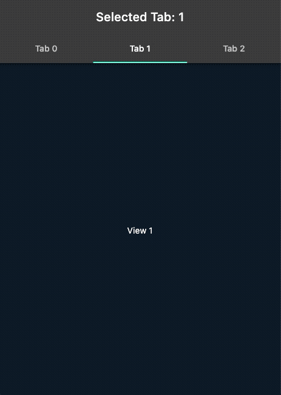

# Flutter Tabs Demo

Code related to blog post:

https://www.flutter-demo.net/2023/01/flutter-using-tabs-simple-demo.html

### Flutter: using Tabs - a simple demo 

How to use Tabs in Flutter, using `DefaultTabController` class, how to set a default Tab and how to listen to updates in TabBar.

